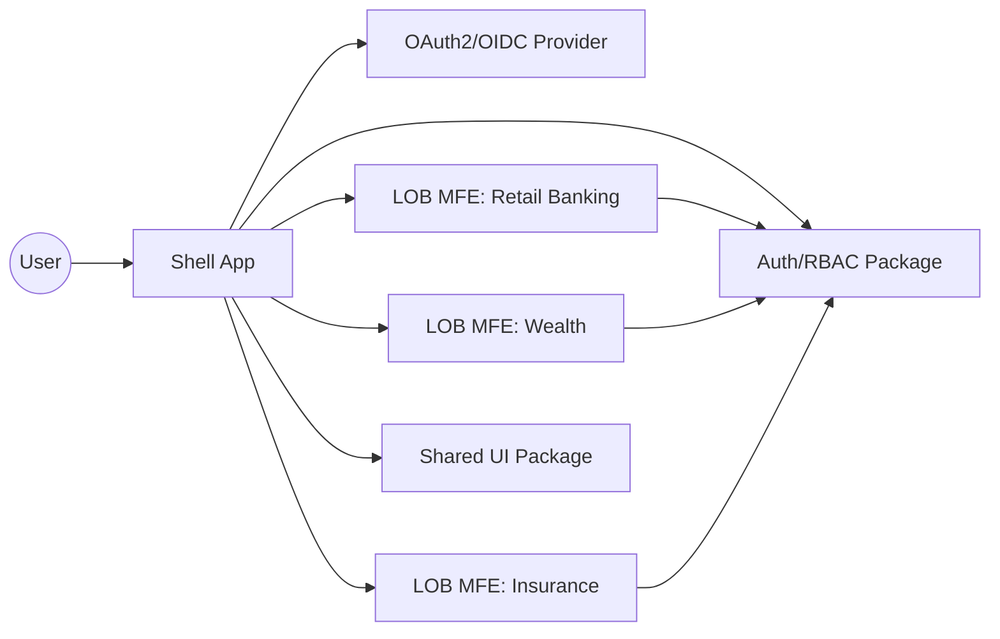

# Architecture Overview

## Goals
- Prove a React microfrontend architecture for a financial services portal.
- Provide a shell app and multiple independently deployed lines of business.
- Enforce RBAC per line of business using OAuth 2.0 JWT claims.
- Enable admin-managed access grants, removals, and access reviews.
- Deliver a sleek, professional UI with consistent theming and shared UI primitives.

## Target Tech Stack
- React + TypeScript + Vite
- Module Federation for runtime composition
- pnpm workspaces + Nx
- ESLint + Prettier, Vitest, Playwright
- Storybook for shared UI (optional but recommended)

## System Context

## Runtime Composition

## Authorization Model
- OAuth 2.0 / OIDC with JWT access tokens.
- RBAC based on JWT claims: `roles`, `permissions`, and `tenant`.
- Each MFE uses a shared `packages/auth` module to:
  - parse and validate token claims
  - enforce feature-level access guards
  - provide hooks like `useAuth()` and `useHasPermission()`
- Admin users use a shared access management UI to grant and revoke LOB access and view current access.

## Deployment Model
- Each MFE builds to a versioned remote entry (for example, `remoteEntry.js`).
- Shell app consumes remotes via environment-configured URLs.
- Shared UI and auth packages are versioned and published internally.

## Key Repo Layout (Target)
- `apps/shell/`
- `apps/mf-*/`
- `packages/shared-ui/`
- `packages/auth/`
- `configs/`

## UI Shell Layout
- Left navigation for lines of business and shared tools.
- Top bar with user avatar, notifications, settings, and theme toggle.
- Shared layout primitives in `packages/shared-ui` to keep LOBs consistent.
