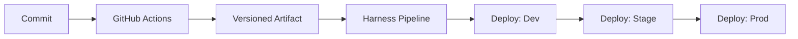

# CI/CD Strategy

## Overview
- GitHub Actions builds, tests, and packages the shell and each microfrontend independently.
- Harness handles environment deployments and approval gates per app.
- Artifacts are versioned per app (for example, `shell@1.2.0`, `mf-orders@0.4.1`).
- Releases are isolated, so each app can run, customize, and deploy without coupling to others.

## GitHub Actions (Build + Package)
Recommended workflows:

1) `ci.yml`
- Triggers: `pull_request`, `push` to `main`
- Steps:
  - Install pnpm and dependencies
  - Lint and typecheck (`nx affected -t lint`)
  - Unit tests (Vitest via `nx affected -t test`)
  - Build affected apps and packages (`nx affected -t build`)
  - Upload build artifacts per app

2) `release.yml`
- Triggers: tagged releases (for example, `app/shell/v1.2.0` or `app/mf-orders/v0.4.1`)
- Steps:
  - Build the target app
  - Package static output
  - Publish artifact to an artifact store (S3, GitHub Releases, or Harness artifact registry)

## Versioning and Tagging Scheme
- Independent semantic versioning per app and package.
- Tag format for apps: `app/<app-name>/v<major>.<minor>.<patch>` (for example, `app/shell/v1.2.0`).
- Tag format for packages: `pkg/<pkg-name>/v<major>.<minor>.<patch>` (for example, `pkg/shared-ui/v0.6.0`).
- Release notes should include compatible remote versions and any contract changes.

## Release Flow (Apps)
1) Merge to `main`.\n2) Create tag `app/<app-name>/vX.Y.Z`.\n3) `release.yml` builds only the tagged app.\n4) Artifact is published and promoted through Harness.

## Harness (Deploy)
Harness pipelines consume build artifacts and deploy per environment.

Stages:
- Validate artifact metadata and signatures
- Deploy to S3 + CloudFront
- Smoke tests
- Manual approval to promote to next environment

Guidance:
- One pipeline per app (shell and each MFE) to preserve independent releases.\n- Inputs include app name, version tag, environment, and remote URL base.\n- Promotion is environment-specific and can be gated by approvals or automated checks.

## Environment Configuration
- Remote entry URLs injected via environment variables.
- Use environment-specific config files or build-time injection (for example, `VITE_REMOTE_MF_ORDERS_URL`).

## Quality Gates
- Lint + typecheck required for merge.
- Unit tests required for merge.
- E2E tests required for promotion to staging.
