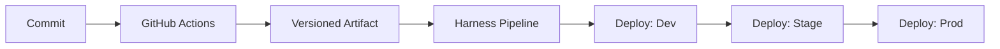

# CI/CD Strategy

## Overview
- GitHub Actions builds, tests, and packages the shell and each microfrontend.
- Harness handles environment deployments and approval gates.
- Artifacts are versioned per app (for example, `shell@1.2.0`, `mf-orders@0.4.1`).

## GitHub Actions (Build + Package)
Recommended workflows:

1) `ci.yml`
- Triggers: `pull_request`, `push` to `main`
- Steps:
  - Install pnpm and dependencies
  - Lint and typecheck
  - Unit tests (Vitest)
  - Build affected apps and packages
  - Upload build artifacts per app

2) `release.yml`
- Triggers: tagged releases (for example, `shell-v1.2.0`)
- Steps:
  - Build the target app
  - Package static output
  - Publish artifact to an artifact store (S3, GitHub Releases, or Harness artifact registry)

## Harness (Deploy)
Harness pipelines consume build artifacts and deploy per environment.

Stages:
- Validate artifact metadata and signatures
- Deploy to S3 + CloudFront
- Smoke tests
- Manual approval to promote to next environment

## Environment Configuration
- Remote entry URLs injected via environment variables.
- Use environment-specific config files or build-time injection (for example, `VITE_REMOTE_MF_ORDERS_URL`).

## Quality Gates
- Lint + typecheck required for merge.
- Unit tests required for merge.
- E2E tests required for promotion to staging.
